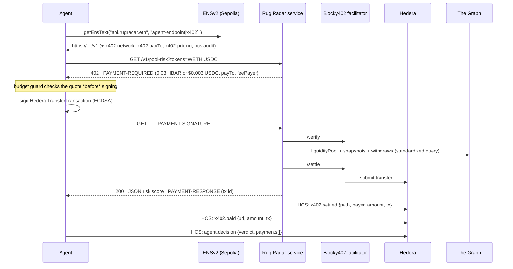

# Rug Radar

**An autonomous agent that pays per call for live DeFi drain and whale intelligence — settled on Hedera with x402, computed from The Graph's standardized subgraphs and Substreams, discovered through ENSv2.**

> "Is the WETH/USDC pool being drained right now?" → the agent resolves `api.rugradar.eth`, hits a `402`, signs a 0.03 HBAR payment, gets a risk score with evidence, and every payment plus the final decision lands on a Hedera Consensus Service topic you can audit on HashScan.

Built from scratch at ETHOnline 2026 for three bounties:

| Bounty | What in this repo satisfies it |
|---|---|
| **Hedera — AI & Agentic Payments (x402)** | Live x402-gated service on Hedera testnet settled through the **Blocky402** facilitator (`packages/service`), and an agent that pays for it (`packages/agent`). Extras: **metered** pricing (per protocol, per lookback day, per 15 s stream window), **streamed micropayments**, **HTS USDC** as an alternative asset, **HCS audit trail** of every settlement and every agent decision, **ERC-8004** registration file, discovery **directory** via ENS. |
| **The Graph — Composable / Standardized Graph Products** | Every endpoint runs **one query string across many protocols** using the **Messari Standardized Subgraphs** (`dex-amm` schema: Uniswap v3, Uniswap v2, SushiSwap, Curve; `lending` schema: Aave v3, Compound v3, Spark). The live whale wire **composes Substreams** (`ethereum-common` package, `filtered_events`) **with a standardized subgraph** for pricing. All data is live from The Graph Network gateway; nothing is mocked. |
| **ENS — Best Use of ENSv2 (Sepolia)** | The namespace `rugradar.eth` owns its **own PermissionedRegistry** and **own PermissionedResolver** (deployed through the VerifiableFactory). Services are **expiring, non-transferable, revocable subnames**; their x402 endpoint, price list, pay-to account and audit topic are **text records** (ENSIP-26 `agent-endpoint[x402]` + `agent-context`). **Enhanced Access Control** delegates exactly one text key (`x402.pricing`) to the service's own key. The agent discovers services by **walking the registry** and resolving through the **Universal Resolver**; nothing about the paid API is hard-coded in the agent. Agents get their own identity subnames too. |

## A real run (2026-09-06, Hedera testnet + ENSv2 Sepolia + The Graph Network)

```
🛰  Rug Radar agent · wallet 0.0.10372230 on hedera:testnet · budget 1 HBAR · model Qwen/Qwen3.8-27B
❓ Is the WETH/USDC pool on Uniswap v3 being drained right now? Should an LP exit?
⚙ discover_services({})            ENS discovery: 1 service(s): api.rugradar.eth
⚙ read_catalog(...)                → GET http://…/v1/catalog (free)
⚙ pool_risk({"tokens":["WETH","USDC"]})   paid 0.03 HBAR · settlement 0.0.7162784@1788663313.356227872 · HCS 0.0.10372230@1788663360.527369081
⚙ scan_whales({"protocols":["uniswap-v3"]}) paid 0.015 HBAR · settlement 0.0.7162784@1788663359.073787482
⚙ pool_risk({"protocol":"uniswap-v3","pool":"0xe0554a47…"}) paid 0.03 HBAR · settlement 0.0.7162784@1788663385.026425010

**Verdict: Watch (not critical)** — the Uniswap v3 WETH/USDC 0.01% pool shows heavy LP churn but no drain:
24h withdrawals $2.49M (68% of TVL) are offset by $2.51M deposits (net +$22.9k), outflow is spread across
many addresses, large swaps run both ways. Recommended action: no exit needed.

💸 Spent 0.075 HBAR of 1 across 3 paid call(s)
🧾 Decision anchored on HCS: https://hashscan.io/testnet/transaction/0.0.10372230%401788663436.746860424
```

## Architecture

```mermaid
flowchart LR
  subgraph Agent["packages/agent — LLM agent (Qwen 3.8) with a Hedera wallet"]
    A1[discover_services] --> A2[read_catalog]
    A2 --> A3[pool_risk / scan_whales / protocol_health / watch_whale_wire]
    A3 --> A4[budget guard + HCS spend ledger]
  end

  subgraph ENS["ENSv2 · Sepolia"]
    E1[(ETHRegistry\nrugradar.eth)] --> E2[(our PermissionedRegistry\napi · scout)]
    E2 --> E3[(our PermissionedResolver\nagent-endpoint[x402], x402.*, hcs.*)]
  end

  subgraph Service["packages/service — x402-gated API on Hedera"]
    S1[GET /v1/whales] & S2[GET /v1/pool-risk] & S3[GET /v1/protocol-health] & S4[GET /v1/stream/whales SSE]
    S5[onAfterSettle → HCS audit]
  end

  subgraph Graph["The Graph"]
    G1[(Messari standardized subgraphs\n4 DEX + 3 lending)]
    G2[(Substreams ethereum-common\nfiltered_events)]
  end

  subgraph Hedera["Hedera testnet"]
    H1[Blocky402 facilitator\nverify + settle]
    H2[(HCS topics\nsettlements · spend ledger)]
  end

  A1 -- Universal Resolver --> E3
  A3 -- "402 → PAYMENT-SIGNATURE" --> Service
  Service -- verify/settle --> H1
  S1 & S2 & S3 --> G1
  S4 --> G2
  S4 -. token prices .-> G1
  S5 --> H2
  A4 --> H2
```

### One paid request, end to end



If the upstream data fails (every protocol query errors, or the stream has no source), the handler returns a non-2xx status and the x402 middleware **cancels the payment** — the agent is never charged for nothing.

## What's metered and how much

| Endpoint | Price (HBAR; USDC quoted alongside) | Data |
|---|---|---|
| `GET /v1/whales?protocols=…&minUsd=&lookback=` | `0.01 + 0.005 × protocols` | Largest swaps and LP withdrawals per DEX, one standardized query per protocol |
| `GET /v1/pool-risk?tokens=WETH,USDC` or `?protocol=&pool=` | `0.03 + 0.01 × extra lookback days` | Drain score 0–100 with factor evidence (7d TVL drawdown, 24h withdrawal pressure, withdrawer concentration, abnormal swaps, age) |
| `GET /v1/protocol-health?protocol=aave-v3` | `0.02` | Lending stress: utilization, hot markets, liquidations |
| `GET /v1/stream/whales?seconds=15..120` | `0.02 per 15 s window` | Server-Sent Events whale wire; re-request to extend = streamed micropayments |
| `GET /v1/catalog`, `/.well-known/agent-registration.json`, `/health` | free | Discovery surface (also linked from ENS records) |

Prices are computed per request (x402 dynamic pricing), so a one-protocol scan and a four-protocol scan produce different `402` quotes.

## Quickstart

Requirements: Node ≥ 22, pnpm 11, one funded Hedera testnet account from https://portal.hedera.com (ECDSA or ED25519; set `HEDERA_SERVICE_KEY_TYPE`), a Subgraph Studio API key, an OpenAI-compatible LLM endpoint (`LLM_BASE_URL`, `LLM_API_KEY`, `LLM_MODEL`; we use Qwen 3.8), and a Sepolia key with a little ETH for the ENS steps.

```bash
pnpm install
cp .env.example .env        # fill in keys (see comments)

# 0. sanity: the same query across every protocol
pnpm graph:smoke

# 1. Hedera: a separate agent wallet (x402 needs payer ≠ payee), audit topics, optional USDC
pnpm hedera:agent-account    # creates a funded ECDSA account; paste HEDERA_AGENT_* into .env
pnpm hedera:topics           # paste HCS_SERVICE_TOPIC_ID / HCS_AGENT_TOPIC_ID into .env
pnpm hedera:associate-usdc   # optional; HBAR needs no association

# 2. run the paid service
pnpm service                 # http://localhost:4021/v1/catalog

# 3. ENSv2 on Sepolia: namespace, then publish the service + the agent identity
pnpm ens:deploy              # deploys our registry + resolver, registers <ENS_PARENT_LABEL>.eth, writes ens.deployment.json
pnpm ens:register api --url https://<public-url-of-service>
pnpm ens:register scout --agent
pnpm ens:resolve api.rugradar.eth
pnpm ens:list
pnpm ens:service-update api "<new pricing string>"   # EAC demo: the service key may edit only x402.pricing

# 4. pay for one call without the LLM ("curl with a wallet")
pnpm demo:curl "/v1/pool-risk?tokens=WETH,USDC"

# 5. the agent
pnpm agent "Is the WETH/USDC pool on Uniswap v3 being drained right now? Should an LP exit?"
```

For a local run before ENS is set up, `SERVICE_URL_OVERRIDE=http://localhost:4021 pnpm demo:curl "/v1/whales?protocols=curve"` skips discovery.

## Demo script (3–4 minutes)

1. **Problem (20 s).** LPs find out about a drain after the fact. Agents can watch pools 24/7, but they need data they can *buy*, not API keys and subscriptions.
2. **Discovery (30 s).** `pnpm ens:resolve api.rugradar.eth` — show the records, the registry hierarchy (`ETHRegistry → our registry → our resolver`), expiry and `transferable: false`. `pnpm ens:service-update api "…"` — the service key edits its price and is refused on any other record.
3. **Pay (60 s).** `pnpm demo:curl "/v1/pool-risk?tokens=WETH,USDC"` — terminal shows `402`, the HBAR quote, the settlement id; open the HashScan link; open the HCS topic and show the `x402.settled` record.
4. **Reason (60 s).** `pnpm agent "…"` — the agent discovers, reads the catalog, buys two or three calls within budget, and prints a verdict with evidence and the list of payments. Show the `agent.decision` record on HCS.
5. **Standards leverage (30 s).** `pnpm graph:smoke` — the same query string running on four DEXes and three lenders; point at `packages/shared/src/graph.ts` and the one line that differs between schema 1.3 and 4.0.
6. **Why mainnet (20 s).** Flip `HEDERA_NETWORK=mainnet` and the facilitator URL; nothing else changes. ENSv2 records move with the name.

## The Graph: what the standard bought us

- `packages/shared/src/protocols.ts` — seven protocols, one registry of subgraph IDs from Messari's deployment manifest, all verified at chain head.
- `packages/shared/src/graph.ts` — three query strings (`whales`, `pool-risk`, `lending-health`) serve seven protocols. The only divergence we hit between schema majors is the event actor field (`from` in 1.3, `account { id }` in 4.0), handled by a one-line switch. Adding an eighth protocol is one JSON entry.
- `packages/service/src/substreams.ts` — the live wire composes the reusable **`ethereum-common`** Substreams package (`filtered_events` with an `evt_sig:` query string) with the standardized Uniswap v3 subgraph for `lastPriceUSD`. Set `SUBSTREAMS_API_TOKEN` (Pinax or StreamingFast) to enable; without it the stream polls the standardized subgraphs so it is still live data.

## ENSv2 features exercised

| Feature | Where |
|---|---|
| Own **PermissionedRegistry** (UserRegistry proxy via VerifiableFactory) as the subregistry of `rugradar.eth` | `packages/ens/src/deploy-namespace.ts` |
| Own **PermissionedResolver** proxy with per-record EAC | same |
| **.eth registration** on the ENSv2 ETH Registrar (MockUSDC, commit → 60 s → reveal) | same |
| **Expiring** (30 d), **non-transferable** (no `ROLE_CAN_TRANSFER_ADMIN`), **revocable** (`unregister`) service subnames | `register-service.ts`, `revoke-service.ts`, `shared/src/ens.ts` |
| **ENSIP-26** agent text records (`agent-context`, `agent-endpoint[x402]`) + namespaced `x402.*` / `hcs.*` / `erc8004.*` keys | `register-service.ts` |
| **Enhanced Access Control** delegation of exactly one text key to the service's key (`authorizeTextRoles`), proven by `service-update.ts` | `register-service.ts`, `service-update.ts` |
| **Universal Resolver** resolution and registry walking in the consumer | `packages/agent/src/discovery.ts`, `packages/ens/src/resolve.ts` |
| **Agents as namespaces**: the agent has its own subname (`scout.rugradar.eth`) with its Hedera account and spend-ledger topic | `pnpm ens:register scout --agent` |

## Hedera: payment flow details

- Scheme `exact` on `hedera:testnet`, facilitator `https://api.testnet.blocky402.com` (mainnet: `https://api.blocky402.com`). The facilitator acts as fee payer; the agent only needs HBAR for the price.
- Two `accepts` per route: HBAR (canonical) and HTS **USDC** (`0.0.429274` testnet). The agent's policy prefers HBAR.
- Server `onAfterSettle` hook → `TopicMessageSubmitTransaction` on `HCS_SERVICE_TOPIC_ID` with `{path, payer, amount, asset, settlementTx}`.
- Agent decodes `PAYMENT-RESPONSE`, enforces `AGENT_BUDGET_HBAR` *before* signing (reads the `PAYMENT-REQUIRED` quote), mirrors each payment to `HCS_AGENT_TOPIC_ID`, then anchors its final verdict there as well.
- `/.well-known/agent-registration.json` is an ERC-8004 registration file (`x402Support: true`); fill `ERC8004_REGISTRY` / `ERC8004_AGENT_ID` after registering with an Identity Registry.

## Live deployment (testnets)

| What | Where |
|---|---|
| ENSv2 namespace `rugradar.eth` (Sepolia) | registered on the ENSv2 ETH Registrar, tx `0x81c5442f…96df` |
| Our PermissionedRegistry (UserRegistry proxy) | [`0x8ff7afe6ad9ED3D06caDFD487fdf059c1938Aa36`](https://sepolia.etherscan.io/address/0x8ff7afe6ad9ED3D06caDFD487fdf059c1938Aa36) |
| Our PermissionedResolver proxy | [`0x132145725Cf0553E226B9e83C461C5F42250E0Ee`](https://sepolia.etherscan.io/address/0x132145725Cf0553E226B9e83C461C5F42250E0Ee) |
| Service name | [`api.rugradar.eth`](https://sepolia.app.ens.domains/api.rugradar.eth) — expiring, non-transferable, `x402.pricing` delegated to `0x129d…9841` |
| Agent name | [`scout.rugradar.eth`](https://sepolia.app.ens.domains/scout.rugradar.eth) |
| Hedera service account (payTo) | [`0.0.5639476`](https://hashscan.io/testnet/account/0.0.5639476) |
| Hedera agent account | [`0.0.10372230`](https://hashscan.io/testnet/account/0.0.10372230) |
| HCS settlement audit topic | [`0.0.10372243`](https://hashscan.io/testnet/topic/0.0.10372243) |
| HCS agent spend ledger | [`0.0.10372244`](https://hashscan.io/testnet/topic/0.0.10372244) |
| Example x402 settlement (0.03 HBAR via Blocky402) | [`0.0.7162784@1788663313.356227872`](https://hashscan.io/testnet/transaction/0.0.7162784%401788663313.356227872) |

## Repository layout

```
packages/shared    protocols registry, Graph gateway client + queries, risk scoring, ENSv2 constants/ABIs, HCS helpers
packages/service   Express + @x402/express on Hedera (Blocky402), metered routes, SSE stream, Substreams wire, ERC-8004 file
packages/agent     tool-calling LLM agent (OpenAI-compatible API, Qwen 3.8), ENS discovery, paying fetch with budget guard, HCS spend ledger, curl demo
packages/ens       deploy-namespace, register-service, service-update (EAC demo), revoke-service, resolve, list (viem, Sepolia)
hackathon.md       bounty analysis and the reasoning behind this project
```

## Honest notes

- ENSv2 contracts on Sepolia are beta and "may change"; addresses and ABIs are pinned in `packages/shared/src/ens.ts` and were verified against the live deployment.
- Messari's Balancer v2 and PancakeSwap v3 Ethereum subgraphs are currently unhealthy on the network (indexing errors / no allocations) and were dropped from the registry; re-adding one is a single JSON entry.
- The risk score is a transparent heuristic over standardized fields, not a trained model. Every factor prints its evidence so an LP (or an LLM) can disagree with it.
- Substreams whale detection watches five tokens (USDC, USDT, DAI, WETH, WBTC) by default; edit `WATCHED_TOKENS`.
- Nothing here is audited. Testnet only unless you know what you are doing.
